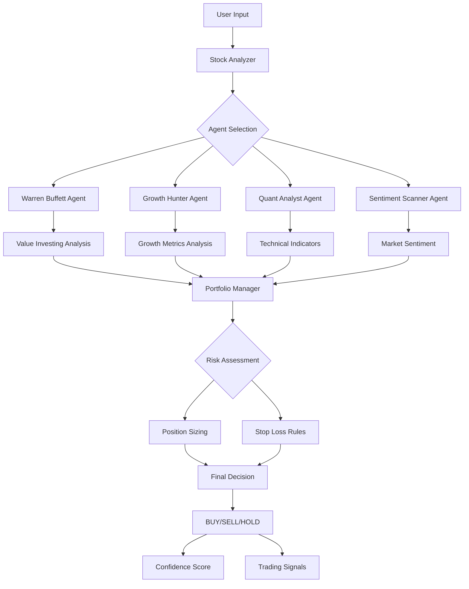
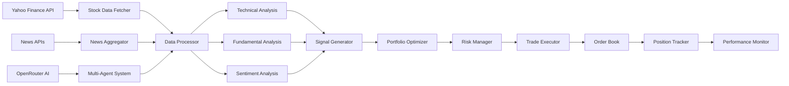
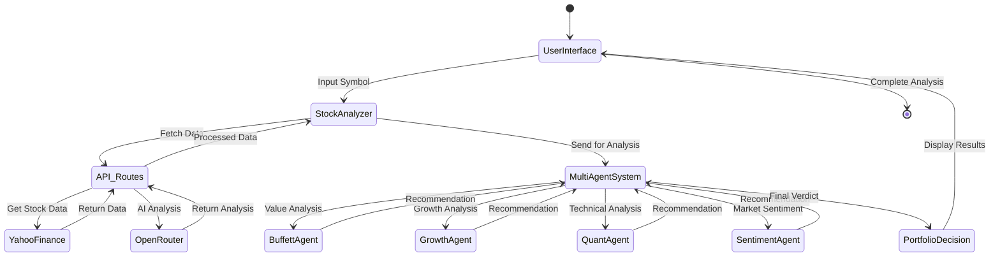
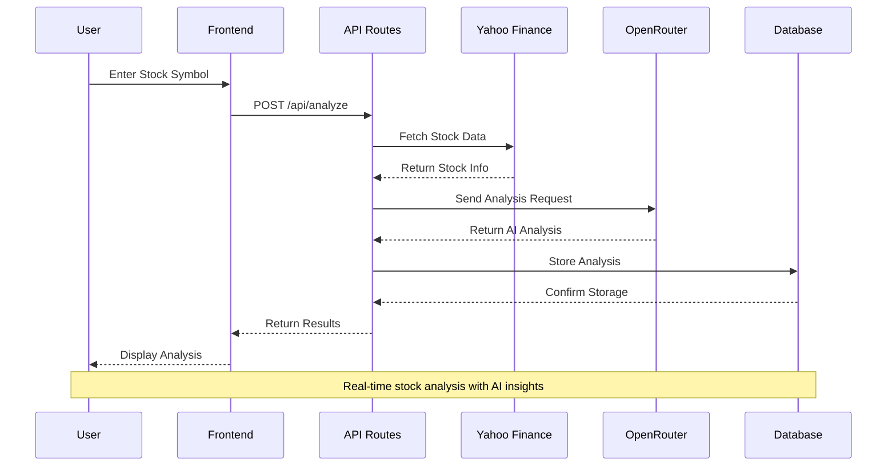

# Wanda AI Hedge Fund - Retail Terminal


[](https://x.com/wandaihedgefund)

CA: [TBD]

This is a proof of concept for an AI-powered hedge fund.  The goal of this project is to explore the use of AI to make trading decisions.  This project is for **educational** purposes only and is not intended for real trading or investment.

This system employs several agents working together:

1. Aswath Damodaran Agent - The Dean of Valuation, focuses on story, numbers, and disciplined valuation
2. Ben Graham Agent - The godfather of value investing, only buys hidden gems with a margin of safety
3. Bill Ackman Agent - An activist investor, takes bold positions and pushes for change
4. Cathie Wood Agent - The queen of growth investing, believes in the power of innovation and disruption
5. Charlie Munger Agent - Warren Buffett's partner, only buys wonderful businesses at fair prices
6. Michael Burry Agent - The Big Short contrarian who hunts for deep value
7. Mohnish Pabrai Agent - The Dhandho investor, who looks for doubles at low risk
8. Nassim Taleb Agent - The Black Swan risk analyst, focuses on tail risk, antifragility, and asymmetric payoffs
9. Peter Lynch Agent - Practical investor who seeks "ten-baggers" in everyday businesses
10. Phil Fisher Agent - Meticulous growth investor who uses deep "scuttlebutt" research 
11. Rakesh Jhunjhunwala Agent - The Big Bull of India
12. Stanley Druckenmiller Agent - Macro legend who hunts for asymmetric opportunities with growth potential
13. Warren Buffett Agent - The oracle of Omaha, seeks wonderful companies at a fair price
14. Valuation Agent - Calculates the intrinsic value of a stock and generates trading signals
15. Sentiment Agent - Analyzes market sentiment and generates trading signals
16. Fundamentals Agent - Analyzes fundamental data and generates trading signals
17. Technicals Agent - Analyzes technical indicators and generates trading signals
18. Risk Manager - Calculates risk metrics and sets position limits
19. Portfolio Manager - Makes final trading decisions and generates orders


[](https://x.com/wandaihedgefund)

## Overview

**AI Hedge Fund** brings institutional-grade investment analysis to retail investors. Using multi-agent AI systems inspired by the virattt/ai-hedge-fund project, this terminal provides real-time stock analysis powered by Yahoo Finance data and OpenRouter AI.

## Features

- AI Stock Analyzer - Input any ticker symbol for instant AI-powered analysis
- Multi-Agent Insights - 4 AI agents (Warren Buffett, Growth Hunter, Quant Analyst, Sentiment Scanner)
- Technical Charts - RSI, SMA, trend indicators with Recharts
- Portfolio Decision - Clear BUY/SELL/HOLD with confidence %
- Share to X - One-click Twitter sharing of analysis results
- News Feed - Real-time news from Yahoo Finance
- AI Persona Switch - Conservative / Balanced / Aggressive modes

## Technical Architecture

### Multi-Agent System Flow
The multi-agent system architecture represents a sophisticated orchestration of specialized AI agents, each embodying the investment philosophy of legendary traders and analysts. When a user inputs a stock symbol, the system initiates a parallel processing pipeline where four distinct AI agents analyze the security from complementary perspectives:

- **Warren Buffett Agent**: Employs value investing principles, seeking companies trading at significant discounts to their intrinsic value with strong fundamentals and competitive moats
- **Growth Hunter Agent**: Focuses on high-growth companies with accelerating revenue trajectories, prioritizing innovation and market expansion potential
- **Quant Analyst Agent**: Applies mathematical models and technical indicators to identify statistical anomalies and momentum patterns in price action
- **Sentiment Scanner Agent**: Analyzes market psychology through news sentiment, social media trends, and institutional positioning

Each agent's analysis feeds into a Portfolio Manager that synthesizes recommendations, applies risk management protocols, and generates final trading decisions with confidence scores.



### Data Pipeline Architecture
The data pipeline represents a real-time financial data processing ecosystem that aggregates multiple data sources to provide comprehensive market intelligence. The system orchestrates data flow from three primary sources:

**Data Ingestion Layer:**
- Yahoo Finance API provides real-time stock quotes, historical price data, and fundamental metrics
- News APIs aggregate financial news from global sources for sentiment analysis
- OpenRouter AI enables advanced natural language processing for qualitative assessments

**Processing Layer:**
- Data Processor normalizes and cleans incoming data streams
- Technical Analysis Engine calculates indicators like RSI, MACD, and moving averages
- Fundamental Analysis evaluates balance sheet strength, cash flow quality, and valuation metrics
- Sentiment Analysis processes news and social media for market psychology insights

**Decision Layer:**
- Signal Generator synthesizes technical, fundamental, and sentiment signals
- Portfolio Optimizer applies Modern Portfolio Theory for asset allocation
- Risk Manager implements position limits, stop-loss rules, and volatility controls
- Trade Executor manages order routing and execution timing



### Component Interaction Diagram
This state diagram illustrates the complex interaction patterns between frontend components and backend services during a complete stock analysis workflow. The system follows a reactive architecture where user interactions trigger cascading data flows through multiple processing layers:

**Frontend Layer:**
- User Interface captures stock symbols and analysis preferences
- Stock Analyzer component orchestrates the analysis workflow
- Multi-Agent System coordinates parallel AI agent processing

**Backend Layer:**
- API Routes handle HTTP requests and response formatting
- External APIs (Yahoo Finance, OpenRouter) provide raw data and AI processing
- Database layer stores analysis results and historical data

**Processing Flow:**
1. User enters stock symbol → Frontend validation
2. API call to `/api/analyze` → Backend processing initiation
3. Parallel data fetching from multiple sources
4. AI agent analysis and signal generation
5. Risk assessment and position sizing calculations
6. Final recommendation with confidence metrics
7. Results display and user feedback loop



### API Endpoints Flow
The sequence diagram demonstrates the synchronous communication patterns between client, server, and external services during stock analysis. This flow showcases the system's ability to orchestrate multiple API calls while maintaining data consistency and user experience:

**Request Flow:**
1. User submits stock symbol through frontend interface
2. Frontend makes authenticated POST request to `/api/analyze`
3. Backend validates request and initiates parallel processing

**Data Acquisition:**
- Yahoo Finance API call retrieves real-time market data
- OpenRouter processes AI analysis requests
- Database operations for caching and persistence

**Response Flow:**
- Backend aggregates all data sources
- Applies business logic and risk calculations
- Returns structured analysis results
- Frontend renders results with interactive visualizations

This architecture ensures sub-second response times while processing complex multi-dimensional analysis across multiple data sources and AI models.



## Tech Stack

- **Framework:** Next.js 16 (App Router)
- **Language:** TypeScript
- **Styling:** Tailwind CSS + shadcn/ui
- **Charts:** Recharts
- **AI:** OpenRouter (Multi-Agent System)
- **Data:** Yahoo Finance API

## Getting Started

### Prerequisites

- Node.js 18+
- pnpm (or npm/yarn)
- OpenRouter API key (get from [openrouter.ai/keys](https://openrouter.ai/keys))

### Installation

```bash
# Clone the repository
git clone https://github.com/omnimasudo/HedgeFund.git
cd HedgeFund

# Install dependencies
pnpm install

# Create environment file
cp .env.example .env.local

# Add your OpenRouter API key to .env.local
# OPENROUTER_API_KEY=sk-or-v1-xxxxx

# Start development server
pnpm dev
```

Open [http://localhost:3000](http://localhost:3000) to view the app.

## Project Structure

```
src/
├── app/
│   ├── api/
│   │   ├── analyze/route.ts   # AI analysis endpoint
│   │   └── stock/route.ts     # Yahoo Finance endpoint
│   ├── page.tsx               # Main dashboard
│   └── layout.tsx            # Root layout
├── components/
│   ├── Sidebar.tsx            # Navigation sidebar
│   ├── StockAnalyzer.tsx      # Main analyzer component
│   ├── StockChart.tsx         # Recharts stock chart
│   ├── AgentCard.tsx          # AI agent insight cards
│   ├── AIReasoningPanel.tsx    # Expandable reasoning panel
│   ├── PortfolioDecision.tsx   # Final decision display
│   └── ...
├── lib/
│   ├── yahoo-finance.ts       # Yahoo Finance API integration
│   ├── openrouter.ts          # OpenRouter AI service
│   └── utils.ts               # Utility functions
└── types/
    └── index.ts               # TypeScript interfaces
```

## Deployment

This app requires Node.js hosting for API routes:

1. **Vercel** (Recommended - Free)
   - Connect your GitHub repo
   - Add `OPENROUTER_API_KEY` in Environment Variables
   - Deploy

2. **Other Platforms**
   - Railway, Render, Fly.io, or any VPS
   - Set `OPENROUTER_API_KEY` environment variable

## Environment Variables

```env
OPENROUTER_API_KEY=sk-or-v1-your-api-key-here
```

Get your API key at [openrouter.ai/keys](https://openrouter.ai/keys)

## UI Preview

The terminal-style interface features:
- Light mode with clean, minimal design
- Bloomberg Terminal aesthetic
- Professional hedge fund vibe
- Data-heavy but readable layout

## License

MIT License - See [LICENSE](LICENSE) for details.

## Credits

- Inspired by [virattt/ai-hedge-fund](https://github.com/virattt/ai-hedge-fund)
- AI powered by [OpenRouter](https://openrouter.ai)
- Stock data from [Yahoo Finance](https://finance.yahoo.com)
